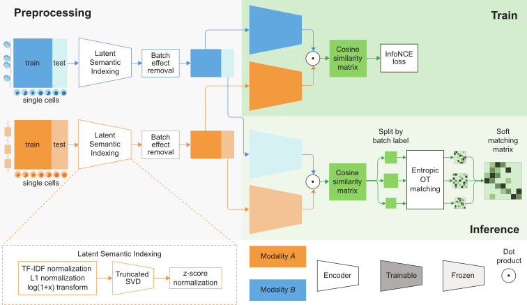

# MatchCLOT

[](https://matchclot.readthedocs.io/en/latest/?badge=latest)

Matching single cells across modalities with contrastive learning and
optimal transport.

Preprint available on bioRxiv
([Gossi et al., 2022](https://www.biorxiv.org/content/10.1101/2022.11.16.516751v1))

## Main functionalities


1. MatchCLOT is a computational framework that is able to
match single-cells measured using different omic modalities.

2. With paired multi-omic data, MatchCLOT uses contrastive learning to learn a common representation between two modalities after applying a preprocessing pipeline for normalization and dimensionality reduction.

3. Based on the similarities between the cells in the learned representation, MatchCLOT finds a matching between the cell profiles in the two omic modalities using entropic optimal transport.

4. Pretrained MatchCLOT models can be applied to new unpaired multiomic data to match two modalities at single-cell resolution.

## Installation and Tutorials

> **_NOTE:_**  The package and the documentation are under development.

MatchCLOT is available on PyPI and can be installed with pip:

```pip install matchclot```

The documentation is available at [https://matchclot.readthedocs.io/en/latest/](https://matchclot.readthedocs.io/en/latest/)
